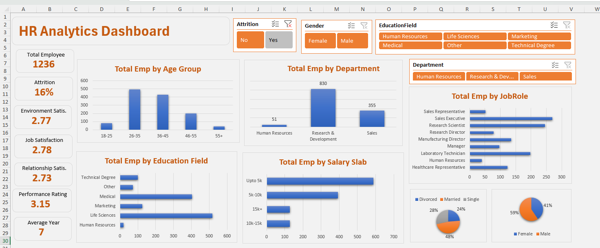

# HR Analytics Dashboard

**Tools:** Excel (data cleaning, pivot tables, slicers, dashboard)

An interactive Excel dashboard that helps an organisation understand its workforce and employee attrition.

*Screenshot shows the dashboard filtered to current employees (Attrition = No).*

## Business question

Who works here, who is leaving, and from which department, age group and salary level?

## Data

1,473 employee records with 38 columns, including age group, department, job role, education field, gender, marital status, salary slab, job and environment satisfaction, performance rating, years at company and attrition status.

## Approach

1. Cleaned the data and used grouping columns such as age group and salary slab.
2. Built pivot tables for headcount by age group, department, education field, salary slab, job role, gender and marital status.
3. Combined them into one dashboard with slicers for attrition, gender, education field and department.

## Key results

| KPI | Value |
| --- | --- |
| Employees in the dataset | 1,473 |
| Employees who left | 237 |
| Attrition rate | 16% |
| Current employees | 1,236 |
| Average job satisfaction (current employees) | 2.78 / 4 |
| Average performance rating (current employees) | 3.15 / 4 |
| Average years at company (current employees) | 7 |

## Insights

- Almost half of all leavers (116 of 237) are aged 26–35.
- Most leavers earn up to 5k a month (163 of 237), so attrition is concentrated in the lowest salary slab.
- Research & Development loses the most people (133), followed by Sales (92).
- Satisfaction scores sit below 3 out of 4, which points to engagement as an area to work on.

## Files

- `HR Analytics.xlsx` – data, pivot tables and dashboard
- `images/hr_dashboard.png` – dashboard screenshot
